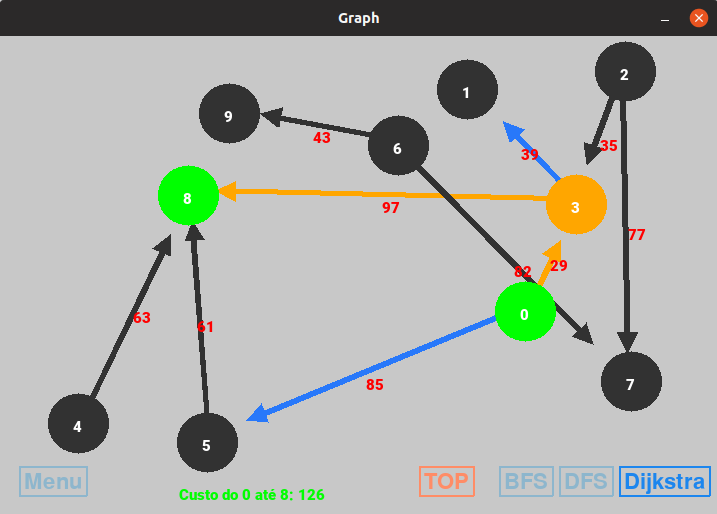

# Grafos2

**Número da Lista**: 2  
**Conteúdo da Disciplina**:

## Alunos

|Matrícula | Aluno |
| -- | -- |
| 17/0070735  |  Lucas Maciel Aguiar |

## Sobre

Este projeto consiste em uma ferramenta para a visualização gráfica do funcionamento do algoritmos de busca Breadth First Search, Depth First Search e algoritmo de Dijkstra para menor caminho em grafos com arestas que possuem pesos ou custos. Além do algoritmo de ordenação Topológica(não implementado graficamente)

## Screenshots

## Instalação

**Linguagem**: Python 3.7  

### Dependências

Para utilizar este programa, deve-se instalar as dependências:

    sudo apt-get update
    sudo apt-get install python-pip
    pip install -r requirements.txt

## Uso

Para iniciar o programa:

    python main.py
