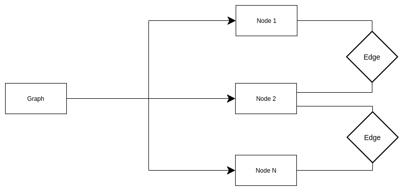

# Estrutura do Grafo

## Graph

A Classe Graph, localizada em './modules/graph.py' tem a seguinte estrutura:

* O Graph realiza o agrupamento de todos os Nodes do grafo
* Os Nodes por vez tem uma aresta para os Nodes vizinhos, que são definidos a partir de um objeto chamado de Edge.

A Classe Graph possuí os seguintes atributos:

* **nodes:** conjunto com todos Nodes que foram adicionados ao grafo
* **edges:** todas as arestas do grafo

## Node

Originalmente os Nodes possuem os seguintes atributos de grafos:

* **value:** identificador único para cada nó no grafo
* **neighbors:** conjunto de Nodes vizinhos a um Node específico
  * **edge:** objeto que representa a aresta entre dois Nodes
  * **node:** referência para o Node vizinho em si

Mas o mesmo objeto Node é unificado com os atributos para identificar os Nodes na screen do pygame:

* **node.color** cor do Node na tela
* **node.posX:** posição do eixo X na tela
* **node.pos:** posição do eixo Y na tela

## Edge

Classe que representa a aresta que liga um Node a Outro, tem os seguintes atributos:

* **start:** posição inicial da aresta com a posição X e Y do primeiro Node, em formato de uma tupla do Python
* **end:** posição final da aresta com suas respectivas posições X e Y do segundo Node
* **color:** cor da aresta na tela
* **value:** indice do edge
